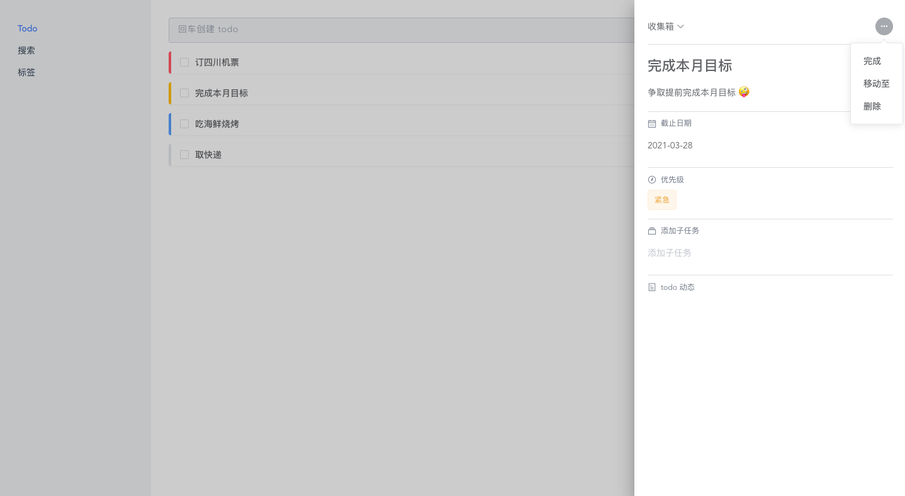

# Todo web

---
### 一个简单 todo web 应用

技术栈 🔨 :
- [Vue3](https://vue3js.cn/docs/zh)
- [Vue-Router](https://next.router.vuejs.org/guide/)
- [Vuex](https://next.vuex.vuejs.org/)
- [Vite](https://vitejs.dev/)
- [tailwindcss](https://tailwindcss.com/)
- [Element+](https://element-plus.gitee.io/#/zh-CN)

功能列表 🌟 :
- [x] 增/删/查/改
- [ ] 搜索
- [x] 拖拽排序
- [x] 标记优先级

本地开发 💻 :
```
yarn

yarn dev
```

页面截图 ✂️ 
> todo 页: 


